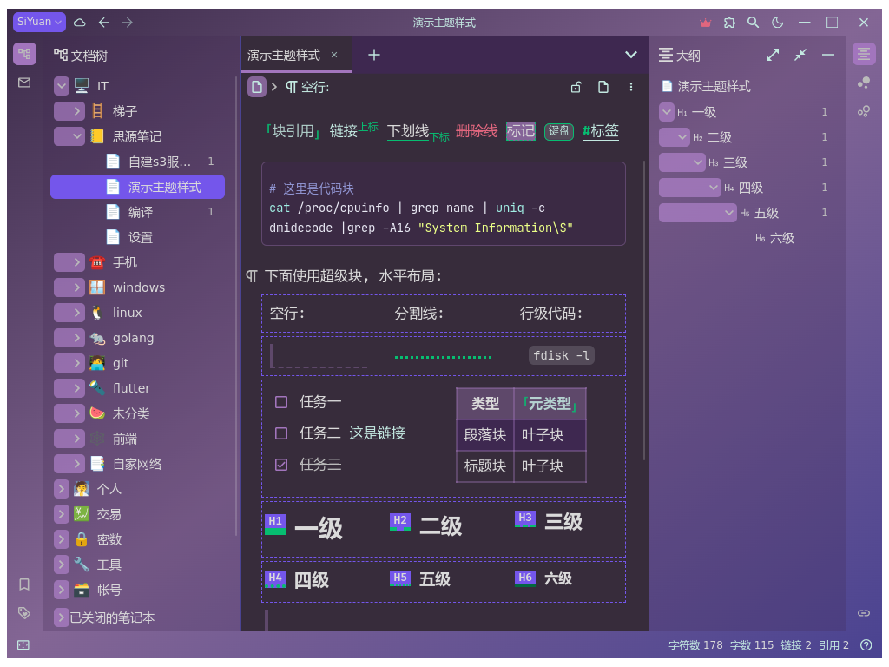

[Siyuan-note](https://github.com/siyuan-note/siyuan) dark grape theme

[中文文档](./README_zh_CN.md)

## Main features

* Use most of the default style of Siyuan Notes and only modify necessary styles.

* Does not modify the style of user text (regular text), only the colors and background colors of bullet/header and code block/link/reference differ from the default style.

* Use colors to clarify the various elements of the interface, increase gradient and semi-transparent effects, and avoid visual fatigue in dark mode.

* The main parts are in various purple, while the embellishments are in green.

## Recommended fonts

"Libration Mono": There are clearly differences between "I L i l", and displays well in bold and symbols.