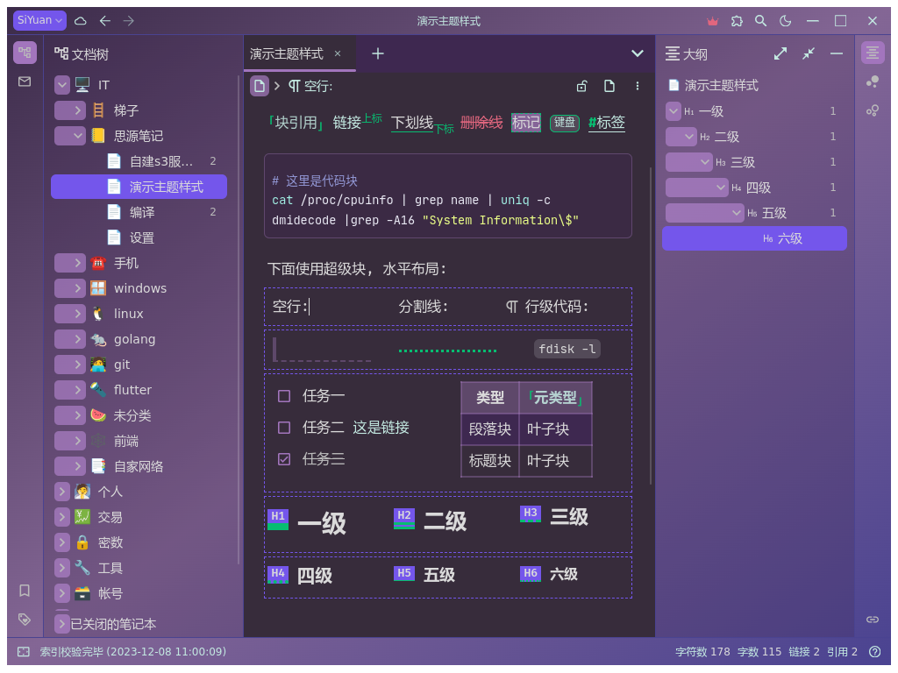

[思源笔记](https://github.com/siyuan-note/siyuan) 夜紫葡萄主题

[English document](./README.md)

夜紫葡萄主题的特点如下：

* 尽量使用思源笔记的默认样式，只修改必要的部分样式。

* 编辑器内不修改用户文本（普通文字）的样式，只有列表的项目符号的颜色 / 表头和代码块背景色 / 链接 / 引用等少数样式和默认样式不同。

* 用颜色明确界面的各个元素，增加渐变和半透明效果，避免深色模式下的视觉疲劳。
  
* 只包含 css 样式，无风险

本项目最初基于 [sy-dark-purple](https://github.com/frostime/sy-dark-purple) 0.4.10， 进行了大幅度修改和重构。